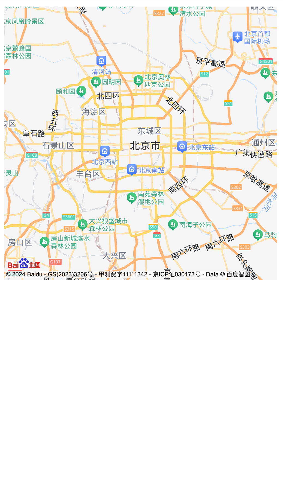

# bmap-jsapi-loader

- jsapi loader for Baidu map. support dynamic importing, you donot need to import the whole jsapi file in html file。

- [click here](http://lbsyun.baidu.com/apiconsole/key) to get your ak.

useage:

```javascript
import BMapLoader from "bmap-jsapi-loader";

BMapLoader.load({
  ak: "your ak", // 百度地图开发者密钥
  type: "webgl", // 加载的 JSAPI 类型
  version: "1.0", // JSAPI 版本
}).then(
  (BMap) => {
    const map = new BMap.Map("bmap-container");
    map.centerAndZoom(new BMap.Point(116.404, 39.915), 11);
  },
  (error) => {
    console.error(error);
  }
);
```


